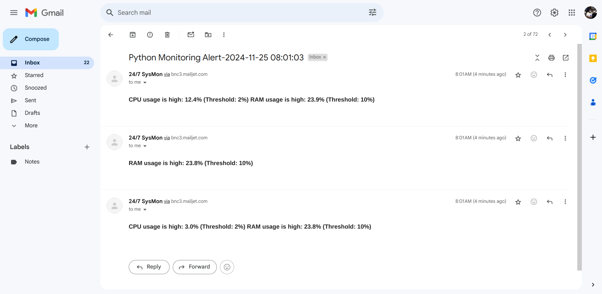

# Python System Monitoring Lab

## Introduction

The **Python System Monitoring Lab** introduces students to server performance monitoring using Python and the `psutil` library. This lab guides learners to define performance thresholds for metrics like CPU, RAM, and disk usage, and send automated email alerts to system administrators when these thresholds are exceeded. It provides hands-on experience integrating third-party libraries and building a foundational monitoring tool.

---

## Lab Objectives

By completing this lab, learners will be able to:

- Monitor system metrics (CPU usage, RAM usage, disk space) using Python and `psutil`.
- Trigger email alerts when system metrics exceed defined thresholds.
- Implement a basic alerting mechanism using Mailjet for email notifications.
- Gain experience integrating third-party Python libraries.
- Build a simple monitoring script with extensibility for more complex use cases.

---

## Tasks Overview

### **Task 1: Sign Up for Mailjet Email API**
1. Create a free Mailjet account.
2. Obtain your API key and secret key from the Mailjet Developer Portal.
   - Refer to the [Mailjet Documentation](https://www.mailjet.com/docs/) for setup assistance.

---

### **Task 2: Python Environment Setup**
1. **Create a Virtual Environment**:
   ```bash
   python3 -m venv <environment_name>
   ```
2. **Activate the Environment**:
   - On Linux/macOS:
     ```bash
     source <environment_name>/bin/activate
     ```
   - On Windows:
     ```cmd
     <environment_name>\Scripts\activate
     ```
3. **Install Required Libraries**:
   ```bash
   pip install psutil mailjet_rest
   ```

---

### **Task 3: Create the Monitoring Script**

1. **Create the Application File**:
   ```bash
   touch monitor.py
   ```
   Write your application code in `monitor.py`.

2. **Import Required Libraries**:
   ```python
   import time
   from mailjet_rest import Client
   import psutil
   ```

3. **Set Up Mailjet Credentials**:
   Define your Mailjet API key and secret key:
   ```python
   api_key = "your_mailjet_api_key"
   api_secret = "your_mailjet_secret_key"
   ```

4. **Define System Time**:
   ```python
   current_time = time.localtime()
   formatted_time = time.strftime("%Y-%m-%d %H:%M:%S", current_time)
   ```

5. **Set Performance Thresholds**:
   ```python
   CPU_THRESHOLD = 10  # Percentage
   RAM_THRESHOLD = 10  # Percentage
   DISK_THRESHOLD = 50 # Percentage (free disk space)
   ```

6. **Create Email Alert Function**:
   ```python
   def send_alert(subject, message):
       mailjet = Client(auth=(api_key, api_secret), version='v3.1')
       data = {
           'Messages': [
               {
                   "From": {"Email": "your_email@example.com", "Name": "24/7 SysMon"},
                   "To": [{"Email": "admin@example.com", "Name": "Admin"}],
                   "Subject": subject,
                   "HTMLPart": f"<h3>{message}</h3>"
               }
           ]
       }
       try:
           result = mailjet.send.create(data=data)
           print(f"Email sent: {result.status_code}")
       except Exception as e:
           print(f"Failed to send email: {str(e)}")
   ```

7. **Monitor System Metrics**:
   ```python
   cpu_usage = psutil.cpu_percent(interval=1)
   ram_usage = psutil.virtual_memory().percent
   disk_usage = psutil.disk_usage('/').percent
   ```

8. **Compose Alert Message**:
   ```python
   alert_message = ""

   if cpu_usage > CPU_THRESHOLD:
       alert_message += f"CPU usage is high: {cpu_usage}% (Threshold: {CPU_THRESHOLD}%)\n"

   if ram_usage > RAM_THRESHOLD:
       alert_message += f"RAM usage is high: {ram_usage}% (Threshold: {RAM_THRESHOLD}%)\n"

   if disk_usage > DISK_THRESHOLD:
       alert_message += f"Disk space is low: {100 - disk_usage}% free (Threshold: {DISK_THRESHOLD}% free)\n"
   ```

9. **Trigger Alert if Thresholds Are Breached**:
   ```python
   if alert_message:
       send_alert(f"Python Monitoring Alert - {formatted_time}", alert_message)
   else:
       print("All system metrics are within normal limits.")
   ```

---

## Running the Monitoring Script
1. Save the script in `monitor.py`.
2. Execute the script:
   ```bash
   python monitor.py
   ```

---

## Evidence of Functionality

The image below shows evidence of the email alert successfully received:


